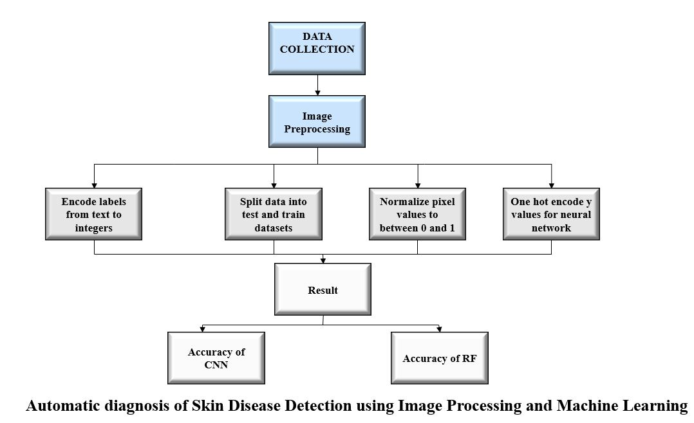

# Automatic-Diagnosis-of-Skin-Disease-Detection-using-Image-Processing-and-Machine-Learning
Basal Cell Carcinoma (BCC), Benign Keratosis-like Lesions (BKL), Melanocytic Nevi (NV) and Melanoma Disease are highly contagious disease showing up symptoms. Diagnosis is very challenging as its lesion pattern may appear quite similar to other skin diseases such as herpangina, aseptic meningitis, and poliomyelitis. Therefore, clinical symptoms are essential besides skin lesion’s pattern and position for precise diagnose of this disease. A combination of Image Processing and Machine Learning detection system can play a significant role in the digital diagnosis of these diseases. Various machine learning and deep learning architectures have been proposed for skin disease diagnosis and classification but their accuracy is not preferred in medical science that’s why this new system has been implemented. 
# Literature Review
There are a lot of diagnosis processes using machine learning and deep learning has already implemented by researchers but we all know that, Diagnosis of different kinds of disease is very much challenging that’s why to get a perfect result we have worked on it. In this work, we have worked on 4 different diseases which are- BasalCell Carcinoma (BCC), Benign Keratosis-like Lesions (BKL), Melanocytic Nevi (NV) and Melanoma Disease. 
Here we have create a combination of Image Processing and Machine Learning  and have implemented two different algorithms which are- Convolutional Neural Network (CNN) and Random Forest (RF). 
# Objectives
To diagnose 4 different skin diseases perfectly. 

To implement a new systematic approach with a combination of Image Processing and Machine Learning 

To get better accuracy working on the mixture of two (2) different algorithms, Convolutional Neural Network (CNN) and Random Forest (RF) 

# Methodology
Step:
Image Processing
Image Classification
CNN -Convolutional Neural Network.
DL -Deep Learning.
Random Forest

